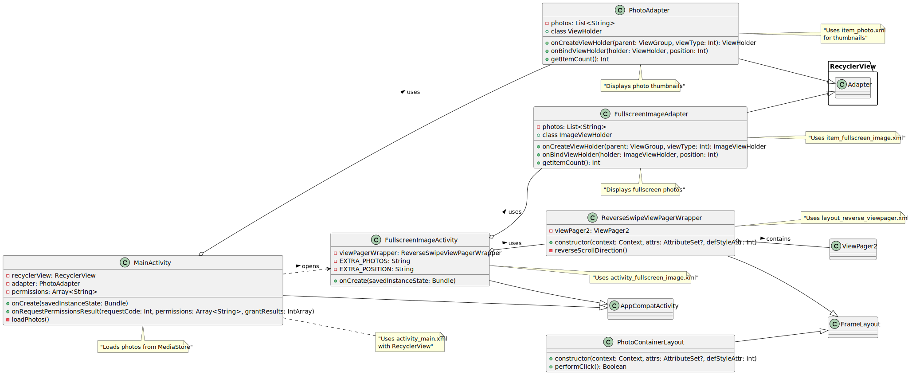

# Pseudocode for PhotoViewer Android Application

## Project Structure



```pseudocode
- MainActivity: Main entry point, displays grid of photos
- PhotoAdapter: Handles displaying photo thumbnails in grid
- FullscreenImageActivity: Shows full-screen photos with swipe navigation
- FullscreenImageAdapter: Handles displaying full-screen photos
- ReverseSwipeViewPagerWrapper: Custom ViewPager2 wrapper that reverses swipe direction
- PhotoContainerLayout: Custom FrameLayout for accessibility
- XML Layouts:
  - activity_main: Main screen layout with RecyclerView
  - item_photo: Layout for photo thumbnails
  - activity_fullscreen_image: Layout for fullscreen photo viewing
  - item_fullscreen_image: Layout for individual fullscreen photos
  - layout_reverse_viewpager: Layout for the custom ViewPager wrapper
```

## MainActivity

```pseudocode
class MainActivity extends AppCompatActivity:
    private variables:
        - recyclerView: RecyclerView
        - adapter: PhotoAdapter
        - permissions: Array of required permissions
    
    function onCreate(savedInstanceState):
        set content view to activity_main layout
        initialize recyclerView
        check and request permissions
    
    function onRequestPermissionsResult(requestCode, permissions, grantResults):
        if permissions granted:
            load photos
        else:
            show permission denied message
    
    function loadPhotos():
        create empty list for photos
        query MediaStore for images using ContentResolver
        for each image in query results:
            add image path to photos list
        create PhotoAdapter with photos list
        set adapter to recyclerView
```

## PhotoAdapter
```pseudocode
class PhotoAdapter extends RecyclerView.Adapter:
    private variables:
        - photos: List of photo paths/URIs
    
    function onCreateViewHolder(parent, viewType):
        inflate item_photo layout
        return new ViewHolder
    
    function onBindViewHolder(holder, position):
        get photo path at position
        load photo into ImageView using Glide
        set click listener to open FullscreenImageActivity
    
    function getItemCount():
        return size of photos list
    
    class ViewHolder extends RecyclerView.ViewHolder:
        contains ImageView for photo thumbnail
```

## FullscreenImageActivity
```pseudocode
class FullscreenImageActivity extends AppCompatActivity:
    private variables:
        - viewPagerWrapper: ReverseSwipeViewPagerWrapper
        - constant EXTRA_PHOTOS: key for photos array
        - constant EXTRA_POSITION: key for position
    
    function onCreate(savedInstanceState):
        set content view to activity_fullscreen_image layout
        initialize viewPagerWrapper
        get photos array and position from intent
        create FullscreenImageAdapter with photos
        set adapter to viewPagerWrapper.viewPager2
        set current item to position
```

## FullscreenImageAdapter
```pseudocode
class FullscreenImageAdapter extends RecyclerView.Adapter:
    private variables:
        - photos: List of photo paths/URIs
    
    function onCreateViewHolder(parent, viewType):
        inflate item_fullscreen_image layout
        return new ImageViewHolder
    
    function onBindViewHolder(holder, position):
        get photo path at position
        if photo starts with "content://":
            load photo from content URI using Glide
        else:
            load photo from file path using Glide
    
    function getItemCount():
        return size of photos list
    
    class ImageViewHolder extends RecyclerView.ViewHolder:
        contains ImageView for fullscreen photo
```

## ReverseSwipeViewPagerWrapper
```pseudocode
class ReverseSwipeViewPagerWrapper extends FrameLayout:
    private variables:
        - viewPager2: ViewPager2
    
    constructor(context, attrs, defStyleAttr):
        inflate layout_reverse_viewpager layout
        initialize viewPager2
        call reverseScrollDirection()
    
    function reverseScrollDirection():
        use reflection to access internal RecyclerView of ViewPager2
        set RecyclerView layout direction to RTL (right-to-left)
        add page transformer to fix visual transition
```

## PhotoContainerLayout
```pseudocode
class PhotoContainerLayout extends FrameLayout:
    constructor(context, attrs, defStyleAttr):
        initialize as FrameLayout
    
    // Custom implementation of performClick for accessibility
    function performClick():
        // Implementation details not shown in snippets
```

