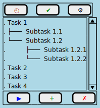

# CSU Global CSC475 Platform Based Development 24WD

This repository contains my solutions while taking CSC475 Platform Based Development (Kotlin with Android Studio) from Colorado State University, Global Campus. 

## Critical Thinking Assignments

### Module 1: Hello Android Calculator

Create a simple Android application that displays a "Hello, Android!" message on the screen when launched. Familiarize yourself with the basic structure of an Android app and practice using Kotlin syntax. Build a basic calculator application that allows users to perform addition, subtraction, multiplication, and division operations. Implement user input and output functionality to create a functional calculator using Kotlin.

Please ensure that your submission includes the following components:

- [Source code file(s)](./HelloAndroidCalculator) containing the program implementation.
- Include [screenshots](./HelloAndroidCalculator/app/src/main/res/raw/screenshots.png) showcasing the successful execution of the program.

### Module 2: Portfolio Project Milestone

For your Portfolio Project you will develop an application in four stages, which will be covered in Modules 2, 4, 6, 8. The project can be of your choice. For this Milestone, you will complete the Requirements Gathering and Analysis portion of the project by drafting a [2 page document](./ToDone/design/Peters_Stephan_CSC475_CT2_ToDoneApp.pdf) that outlines purpose and scope of the app. Identify the target audience and their needs. List the key features and functionalities of the app. Analyze any specific UI/UX requirements.

### Module 3: To Do List

Develop a to-do list application that allows users to add, delete, and mark tasks as completed. Implement data storage using SQLite database to store and retrieve the to-do items. Focus on understanding data persistence concepts in Android.

Please ensure that your submission includes the following components:

- [Source code file(s)](./ToDoLite/) containing the program implementation.
- include [screenshots](./ToDoLite/app/src/main/res/raw/screenshots.png) showcasing the successful execution of the program. Compile and submit your [pseudocode](./ToDoLite/pseudocode/ToDoLite.pseudocode), source code, and screenshots of the application executing the application.

### Module 4: Portfolio Project Milestone

Submit the [design document](./ToDone/design/Peters_Stephan_CSC475_CT4_ToDoneApp_DesignDocument.pdf) (2 pages) that outlines the design specifics for your app. The document should cover the app's architecture, components, and overall user interface layout. It is recommended to include [wireframes](./ToDone/design/MainUIStructure.svg) or [mockups](./ToDone/design/InitialDesignMockUp.png) to visually demonstrate the app's design.

  

### Module 5: Photo Gallery

Build a photo gallery application that displays a grid of images  fetched from the device's storage or an online source. Implement basic  image loading and rendering functionalities, allowing users to view and  scroll through a collection of photos.

Please ensure that your submission includes the following components:

- [Source code file(s)](./PhotoViewer/) containing the program implementation.
- Include [screenshots](./PhotoViewer/app/src/main/res/raw/screenshots.png) showcasing the successful execution of the program.
- Compile and submit your [pseudocode](./PhotoViewer/PseudoCode_ProjectStructure/PhotoViewer_Pseudocode.md), source code, and  screenshots of executing the application.

## Discussions (Selected)

